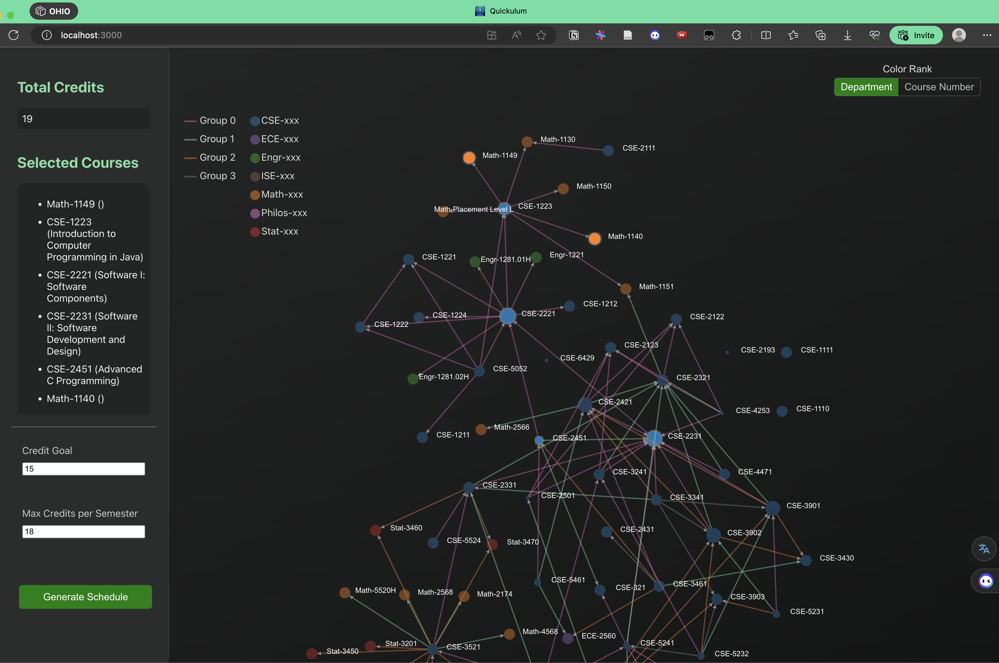
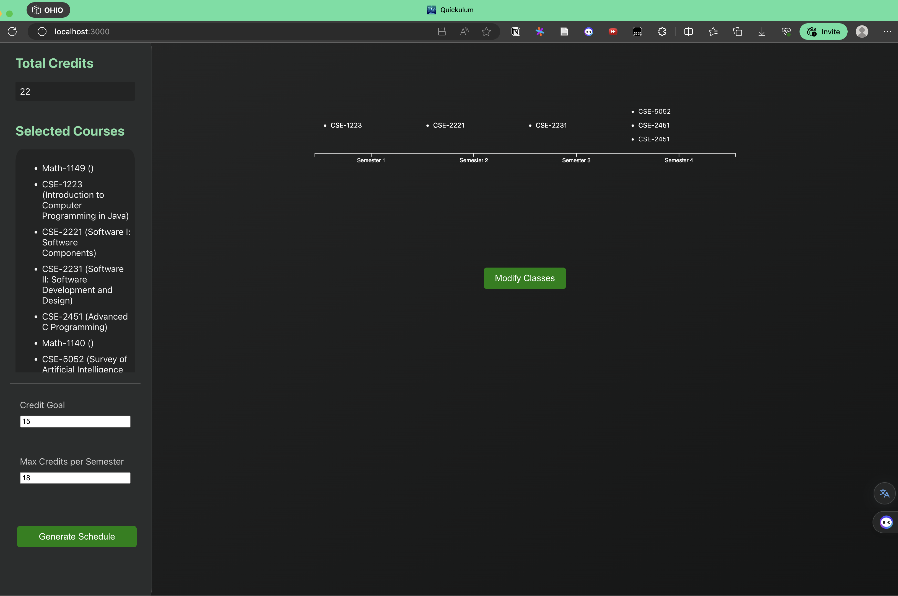

# Quickulum: class dependency graph visualizer and schedule planner

## Overview
Quickulum is a web application, initially developed for the OHI/O hackathon, that enables students to visualize their degree requirements and plan their schedules. Originally designed for Computer Science and Engineering (CSE) majors at The Ohio State University, it utilizes the MERN stack (MongoDB, Express, React, Node.js). The future plan is to expand Quickulum into a comprehensive web application that caters to all majors across various universities.





## Features
### Dependency graph visualization
#### Understanding the Course Graph

- Nodes: Each node represents a course.
- Edges: These show the prerequisites for each course. For example, if course A is a prerequisite for course B, there will be an edge from A to B.
#### Boolean Dependencies:

Some courses have multiple prerequisite options. For example, to enroll in course A, you might need either course B or C, but also need courses D or E. A ~ B|C & D|E

#### Color Encoding:

**For Nodes (Courses):**
- Colors indicate a type or category of the course based on specific rules.
- You can toggle between two color modes:
    - By department ranking
    - By course number ranking

**For Edges (Prerequisites):**
- Colors show boolean dependencies. Courses with the same color are part of the same prerequisite group.
#### Interacting with the Graph:

- Moving Nodes: Simply drag them to reposition.
- Selecting a Course: Click on a node. The chosen course will be highlighted.
- Deselecting a Course: Click the highlighted node again.
- Course Selection Rules: Ensure you select and deselect courses according to prerequisite requirements.

## Getting Started
```bash
cd quickulum
npm install
npm start
```

## Implementation Details
### Course Data
This project utilizes the `https://content.osu.edu` API to fetch course data. The retrieved data undergoes processing and is subsequently stored in a MongoDB database for efficient data management. To enhance the representation of boolean dependencies, the API response is parsed using the `GPT-3.5-turbo` API. This process transforms the prerequisites into nested arrays, providing a more structured and comprehensible format.
```json
{
    "CSE-2321": {
        "classNumber": "2321",
        "department": "CSE",
        "name": "Foundations I: Discrete Structures",
        "dependencies": [
            [
                "CSE-2122",
                "CSE-2123"
            ],
            [
                "Math-1151"
            ]
        ],
        "credits": 3
    },
    "CSE-2111": {
        "classNumber": "2111",
        "department": "CSE",
        "name": "Modeling and Problem Solving with Spreadsheets and Databases",
        "dependencies": [
            [
                "Math-1130"
            ]
        ],
        "credits": 3
    },
    ...
}
```
In the future, we are planning to implement a universal web scraper to retrieve course data from the university website. This will allow us to expand the application to other universities.

### Dependency Graph 
The dependency graph is created using the d3 library. It uses several forces to organize the graph:

- Many-body force: This is a common force that simulates the gravitational attraction or electrostatic repulsion between nodes.
- Collision force: Prevents nodes from overlapping.
- Central force: Pulls nodes towards a center point.
- Link force: Attracts connected nodes towards each other.

In addition to these, we've added custom forces to maintain clarity in the graph:

- Y-positional force: Nodes are initialized based on their topological order and a y-directional force is applied to maintain this order.
- Node-edge repulsion force: This keeps nodes from overlapping with edges. For simplicity, center points of edges are used to calculate repulsion.

### Topological sort with multiple constraints
**Constraints in Path-Finding Algorithm:**
- Total credits
- Boolean dependencies
- Concurrency limit (max number of credits that can be taken in a semester)
- Time conflicts (to be implemented)

**Frontend & Backend Division:**
In order to streamline the algorithm, the first two constraints are managed by the frontend. The user can only generate a course schedule when the total credits exceed the credit goal set by the user. Boolean dependencies are maintained by implementing rules during the course selection and deselection process, ensuring the integrity of the boolean dependency graph. Consequently, the backend algorithm is solely responsible for ensuring that the concurrency limit is adhered to and that there are no time conflicts within a semester.


## Future Plan and Contributions
1. Visualize courses in schedule as nodes
1. Implement a time conflict checker.
1. Implement a universal web scraper to retrieve course data from the university website.

We welcome contributions! Please see `CONTRIBUTING.md` for details.

## License
MIT License

## Acknowledgements